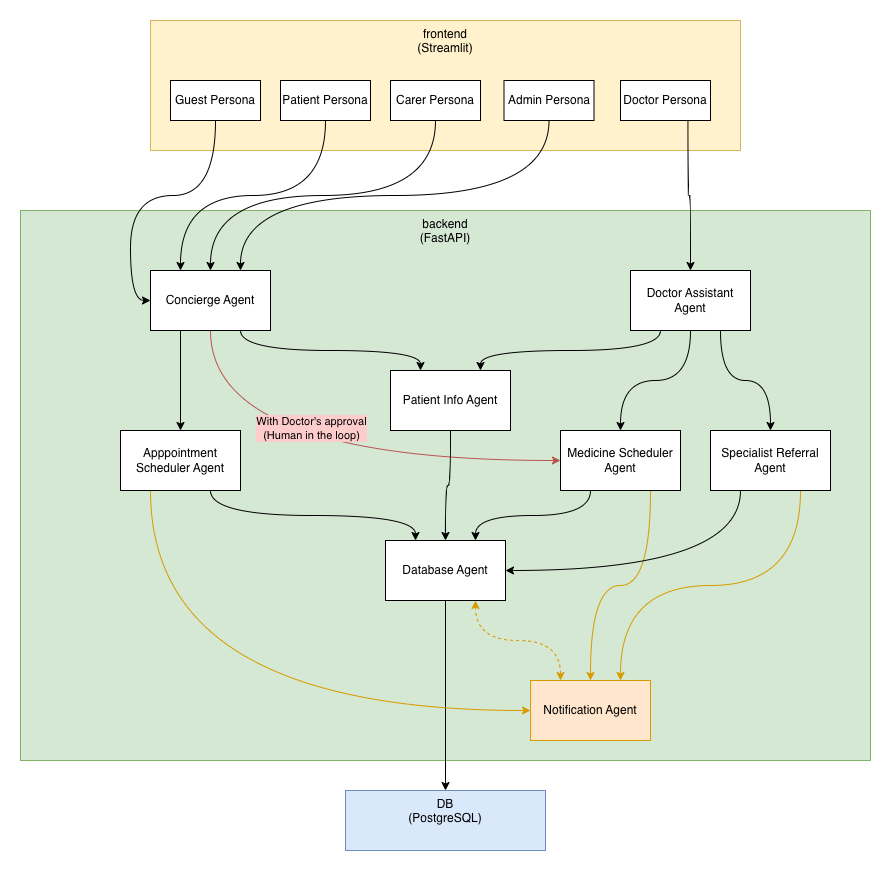

# My AI Health Line
**Smart, accessible healthcare — right in your hands.**

My AI Health Line is an AI-powered, multi-agent healthcare support system designed to help underserved communities where long clinic queues, limited medical staff, and frequent power interruptions make access to care difficult. The system brings healthcare to the palm of your hand through mobile, SMS, and low-resource–friendly technologies.

---

## 🚀 Project Overview

My AI Health Line uses a cooperative multi-agent setup to:
- Register patients and caregivers  
- Provide symptom-based triage  
- Assign queue numbers remotely  
- Manage clinic appointments and referrals  
- Assist doctors with records and consultation notes  
- Deliver SMS and in-app notifications  
- Handle medicine reminders and scheduling  
- Remain resilient during power outages  

Designed for local deployment using Docker and minimal hardware, it's ideal for rural clinics, small municipalities, NGOs, or community health centers.

---

## 🧠 Core Agent System

### **1. Concierge Agent**
- Registers new patients and guardians  
- Collects symptoms  
- Performs emergency triage  
- Issues queue numbers  

### **2. Database Agent**
- Stores and retrieves patient data  
- Syncs data reliably after outages  

### **3. Scheduler Agent**
- Manages queue order  
- Schedules appointments  
- Estimates wait times  

### **4. Notification Agent**
- Sends SMS, email, and app notifications  
- Handles medicine reminders  
- Works during power interruptions  

### **5. Doctor Assistant Agent**
- Provides access to patient history  
- Records consultation notes  
- Issues prescriptions  

### **6. Specialist Referral Agent**
- Creates referral documents  
- Sends follow-up notifications  

### **7. Medicine Scheduler Agent**
- Generates medicine intake reminders  
- Tracks medication routines  
- Allows patient–doctor change requests  

---

## 📦 Tech Stack

- **Backend:** FastAPI  
- **Agent Framework:** Google ADK
- **Database:** PostgreSQL
- **Queueing & Scheduling:** Internal agents  
- **Notifications:** SMS (via Mock API for demo), Email, App  
- **Deployment:** Docker Compose  
- **Monitoring:** Basic observability through logs + agent events  

---
## 🏗️ Architecture


It shows:
- Frontend (Streamlit) calling FastAPI
- Concierge Agent orchestrating with DB Agent (patient CRUD), memory, and session services
- Postgres for persistence (patients, carers, appointments, medications, conversations, login sessions)
The diagram was created to mirror the conversational + agent orchestration pattern used here: a user-facing concierge delegates structured requests (e.g., patient CRUD) to a backend DB-focused agent via function tools.

---

## 🗄️ Database Schema (Simplified)
Key tables:
- patients, carers, doctors
- conditions, appointments, referrals, medication_schedules, notifications
- users, login_sessions, user_patient_access
- conversation_sessions, conversation_messages

---

## 🐳 How to Run (Docker Compose)
1) Install Docker + Docker Compose.
2) Clone the repo:
```bash
git clone https://github.com/laizk/my-ai-health-line
cd my-ai-health-line
```
3) Start services:
```bash
docker compose up --build
```
4) Access:
- Streamlit frontend: http://localhost:8501
- FastAPI docs: http://localhost:8010/docs
5) (Optional) Re-seed DB: drop the Postgres volume and restart compose to apply init SQL under `apps/storage/initdb/`.

## 📱 Features for Low-Resource Communities

- SMS fallback for reminders and queue updates  
- Mobile-friendly doctor and admin UI  

---

## 🎯 Target Users

- Municipal health centers  
- NGOs / humanitarian groups  
- School clinics  
- Barangay health stations  

---

## 🧪 Future Enhancements

- Voice-based concierge agent  
- Multi-language SMS support  
- Offline-first PWA app  
- Analytics dashboard  
- Patient card QR scanning  

---

## 🤝 Contributing

Pull requests are welcome!  
This project aims to help communities in need — contributions that improve accessibility, reliability, and inclusivity are especially encouraged.

---


## 💙 Acknowledgements

Built as a capstone project for **Kaggle × Google AI Intensive Training (Agents for Good Track)** https://www.kaggle.com/competitions/agents-intensive-capstone-project.
Designed to empower communities through accessible, smart healthcare systems.
